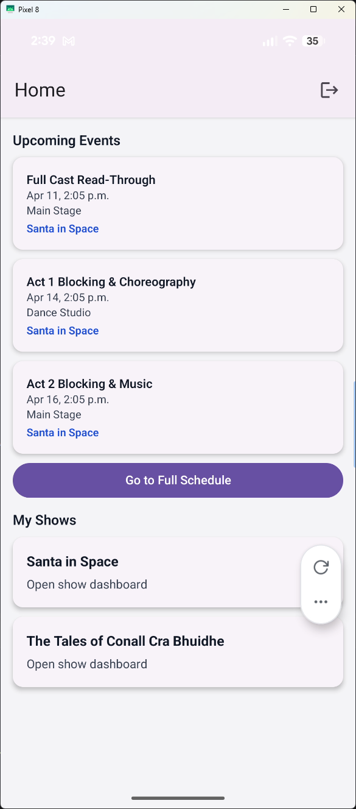
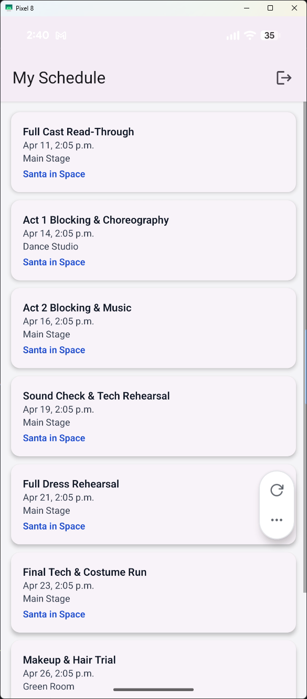
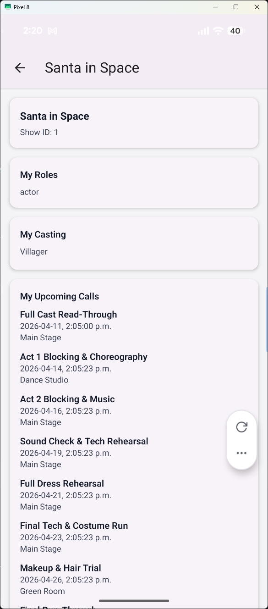

## Performing Arts Manager - Mobile

A React Native mobile app for [Performing Arts Manager](https://github.com/Mindstormman06/performing-arts-manager). 
It gives cast and crew a fast way to check their upcoming rehearsals, see which shows they belong to, and jump into a show-specific dashboard while on the go.

## Features

- Secure login and sign up flow
- Home screen with your 3 closest upcoming schedule events
- Card-based display of all shows you are part of
- Tap a show card to open that show’s dashboard
- Full schedule screen for viewing every assigned event
- Show dashboard with roles, casting, upcoming calls, and assigned inventory
- Token persistence with `expo-secure-store`

## Screenshots

### Home



### Schedule



### Show dashboard



## Tech Stack

- Expo / React Native
- React Navigation
- React Native Paper
- NativeWind / Tailwind CSS
- `expo-secure-store` for authentication token storage

## Project Structure

```text
performing-arts-manager-mobile/
├── documentation/
│   └── UI/
│       └── development_screencaps/
├── pam-mobile/
│   ├── App.js
│   ├── app.json
│   ├── package.json
│   └── src/
│       ├── context/
│       ├── navigation/
│       ├── screens/
│       └── services/
└── README.md
```

## Prerequisites

- Node.js and npm
- Expo CLI support through `npx`
- Expo Go on a physical device, or an Android/iOS simulator
- Access to the Performing Arts Manager backend API

## Setup

1. Clone the repository.
2. Install dependencies from the mobile app directory:

```bash
cd pam-mobile
npm install
```

3. Start the Expo development server:

```bash
npm start
```

You can also launch directly with:

```bash
npm run android
npm run ios
npm run web
```

## Backend Notes

- The mobile app currently points to a fixed API base URL in `pam-mobile/src/services/api.js`:

  `https://appdev.itas.ca:5006/api`

- If you need to target a different backend, update that file.
- Authentication tokens are stored locally with `expo-secure-store`, then reused to restore the session on app launch.
- The app depends on backend endpoints for login, token verification, personal schedule, show membership, and show dashboards.

## App Flow

1. Open the app and log in or create an account.
2. After login, land on the home screen.
3. Review your next 3 upcoming events at the top.
4. Browse the cards for each show you belong to.
5. Tap a show card to open its dashboard.
6. Use the schedule screen to see the full list of assigned events.

## License

See [LICENSE](LICENSE) for licensing information.
